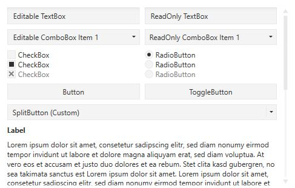
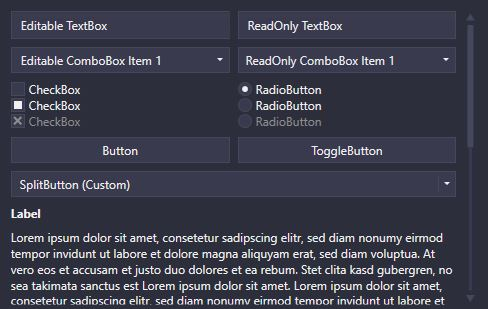

# AdonisUI 💪
Lightweight UI toolkit for WPF applications offering classic but enhanced windows visuals




## What's included

- Default styles with templates for most common WPF controls
- Additional styles for convenience that can be used as required
- Two color schemes (light and dark) that can be used in custom styles as well
- Support for changing the color scheme at runtime
- Support for additional custom color schemes
- Few custom controls for common use cases

## Getting started

1. Reference `AdonisUI` and `AdonisUI.ClassicTheme`
2. Add resources to your application in your `App.xaml` like so:

```xml
<Application xmlns:adonisUi="clr-namespace:AdonisUI;assembly=AdonisUI">
    <Application.Resources>
        <ResourceDictionary>
            <ResourceDictionary.MergedDictionaries>
                <ResourceDictionary Source="{x:Static adonisUi:ResourceLocator.LightColorScheme}"/>
                <ResourceDictionary Source="{x:Static adonisUi:ResourceLocator.ClassicTheme}"/>
            </ResourceDictionary.MergedDictionaries>
        </ResourceDictionary>
    </Application.Resources>
</Application>
```

3. Derive your window's style from the default style of AdonisUI like so:

```xml
<Window.Style>
    <Style TargetType="Window" BasedOn="{StaticResource {x:Type Window}}"/>
</Window.Style>
```

## Concepts

### ComponentResourceKeys

Resources that are provided by AdonisUI have a ComponentResourceKey assigned to make use of them in a simple way. Resources exist in the categories _Colors_, _Brushes_, _Dimensions_ and _Styles_. The foreground brush of the current color scheme for example can be used by referring to its resource key like `Foreground="{DynamicResource {x:Static adonisUi:Brushes.ForegroundBrush}}"`. ComponentResourceKeys allow auto-completion with IntelliSense which comes in handy when exploring the available resources.

### Layers

WIP
