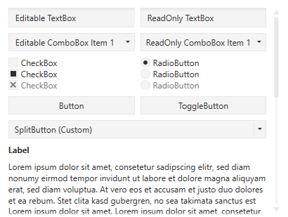
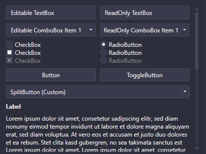
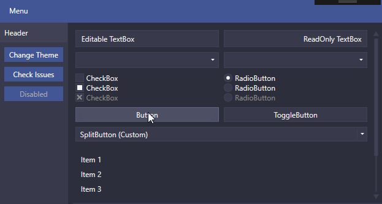
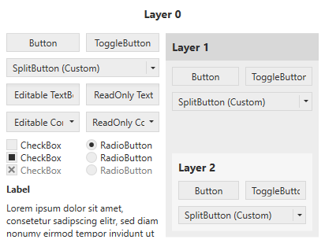
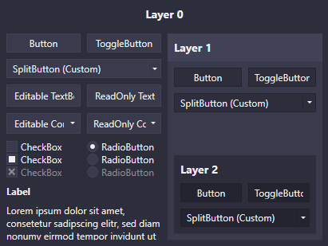
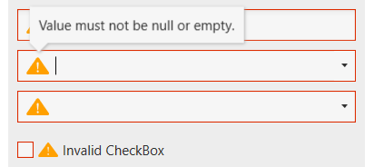
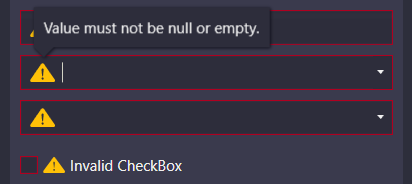

#  AdonisUI

[](https://www.nuget.org/packages/AdonisUI.ClassicTheme/)
[](https://www.nuget.org/packages/AdonisUI.ClassicTheme/)

[](https://opensource.org/licenses/MIT)	

Lightweight UI toolkit for WPF applications offering classic but enhanced windows visuals




## What's included

- Default styles with templates for most common WPF controls
- Additional styles for convenience that can be used as required
- Two color schemes (light and dark) that can be used in custom styles as well
- Support for changing the color scheme at runtime
- Support for additional custom color schemes
- Few custom controls for common use cases

## Getting started

1. Reference `AdonisUI` and `AdonisUI.ClassicTheme` in your WPF project. It is available via [NuGet](https://www.nuget.org/packages/AdonisUI.ClassicTheme/) or [manual download](https://github.com/benruehl/adonis-ui/releases). Currently it requires at least .NET 4.0.
2. Add resources to your application in your `App.xaml` like so:

```xml
<Application xmlns:adonisUi="clr-namespace:AdonisUI;assembly=AdonisUI">
    <Application.Resources>
        <ResourceDictionary>
            <ResourceDictionary.MergedDictionaries>
                <ResourceDictionary Source="{x:Static adonisUi:ResourceLocator.LightColorScheme}"/>
                <ResourceDictionary Source="{x:Static adonisUi:ResourceLocator.ClassicTheme}"/>
            </ResourceDictionary.MergedDictionaries>
        </ResourceDictionary>
    </Application.Resources>
</Application>
```

3. Derive your window's style from the default style of AdonisUI like so:

```xml
<Window.Style>
    <Style TargetType="Window" BasedOn="{StaticResource {x:Type Window}}"/>
</Window.Style>
```

## Features

### Switching color schemes at runtime

AdonisUI comes with a light and a dark color scheme. Adding custom color schemes is possible without limitations. To switch color schemes at runtime the `ResourceDictionary` containing all colors and brushes of a scheme needs to be removed from the application resources so that a different one can be added. This can be done using the built-in `ResourceLocator` class for example in a click event handler.

```csharp
AdonisUI.ResourceLocator.SetColorScheme(Application.Current.Resources, ResourceLocator.DarkColorScheme);
```

The first parameter needs to be a reference to the `ResourceDictionary` containing the color scheme as part of its `MergedDictionaries`. The second parameter is a Uri to the color scheme that should be added. Switching to a custom color scheme would look like the following.

```csharp
Uri uriToCustomColorScheme = new Uri("pack://application:,,,/MyApp;component/ColorSchemes/CustomColorScheme.xaml", UriKind.Absolute)
AdonisUI.ResourceLocator.SetColorScheme(Application.Current.Resources, uriToCustomColorScheme);
```

If one wants to switch off of a custom color scheme, this `uriToCustomColorScheme` has to be provided as the third parameter. Switching off of built-in color schemes does not require this.

### Cursor Spotlight hover effect

UI Controls like Buttons, TextBoxes, ComboBoxes, ListBoxes etc. that rely on interaction make use of a hover effect called Cursor Spotlight here. It makes a layer visible around the cursor when hovering over the control that is hidden otherwise. It works for both color schemes.



Because it works with `OpacityMasks` it is not limited to lightening up UI controls. It can be used to show an hide pretty much everything that can be rendered with WPF.

### Accent color

While relying on uniform colors for background areas and borders, an accent color can be used for visual highlighting of important spots. By default, both color schemes use blue as their accent color. This can be changed by overriding the accent color values. A set of styles helps to display controls like Buttons on the accent color to avoid having the default gray colors on it.

### Layers

In UI design it is common to have containers grouping items that belong together. In WPF this can easily be achieved using GroupBoxes for example. If the container has a different background color assigned to better differentiate between the grouped items and their surroundings, color contrast can become an issue. Gray buttons might look good on a white application background in the first place, but when they are moved into a GroupBox that has a gray background as well, they can loose visibility.

That is why AdonisUI introduces a simple layering system which automatically adjusts the colors of UI controls depending on the layer they belong to. The feature is completely optional but recommended to use if containers are nested.

| Without Layering System | With Layering System |
| --- | --- |
|  | 

| Without Layering System | With Layering System |
| --- | --- |
|  |  

The difference between the shown images might not be obvious at first but is clearly visible for the buttons on layer 1 for example. Without using the system all instances of Button have the same background color. When this color is used as a background color for the container like it is for the GroupBox, the Buttons can become kind of hard to sport. When using the layering system, the background colors of the GroupBoxes are set automatically and the contained Buttons are adjusted in their colors.

By default, a window starts on layer 0 with all of its UI controls being on layer 1. To tell AdonisUI that a container represents a different layer the `IncreaseLayer` property can be set:

```xml
<!-- xmlns:adonisExtensions="clr-namespace:AdonisUI.Extensions;assembly=AdonisUI" -->
<GroupBox adonisExtensions:LayerExtension.IncreaseLayer="True">
```

Or alternatively the layer can be forced to a specific value by setting the `Layer` property:

```xml
<!-- xmlns:adonisExtensions="clr-namespace:AdonisUI.Extensions;assembly=AdonisUI" -->
<GroupBox adonisExtensions:LayerExtension.Layer="1">
```

The `Layer` property is inherited to all child controls which makes items like Buttons contained in this GroupBox being automatically on layer 2. Exceptions can be made as well by applying the property to specific items. Currently AdonisUI supports nesting of such containers up to layer 4. GroupBoxes increase the layer by default. The colors of all components on all layers can be adjusted to match one's preference.

### Data validation support

The data validation mechanism of WPF provides the ability to validate property values and assign error messages in case they are invalid. With AdonisUI, if a control binds to an invalid property the error is indicated in the control template by a red border and an error icon. The error message is displayed as a popup when the control gains keyboard focus or the user hovers over the icon. To set validation errors the interface `IDataErrorInfo` or `INotifyDataErrorInfo` from WPF can be used.




By default the error message popup is displayed on keyboard focus and mouse hover. Both can be disabled separately.

### ComponentResourceKeys

Resources that are provided by AdonisUI have a ComponentResourceKey assigned to make use of them in a simple way. Resources exist in the categories _Colors_, _Brushes_, _Dimensions_, _Styles_, _Templates_ and _Icons_. The foreground brush of the current color scheme for example can be used by referring to its resource key like `Foreground="{DynamicResource {x:Static adonisUi:Brushes.ForegroundBrush}}"`. ComponentResourceKeys allow auto-completion with IntelliSense which comes in handy when exploring the available resources.

## Demo

There is a WPF demo application on board that shows most features of AdonisUI in action. Please don't hesitate to give it a try. More examples and screenshots are following soon.

## License

MIT © Benjamin Rühl
