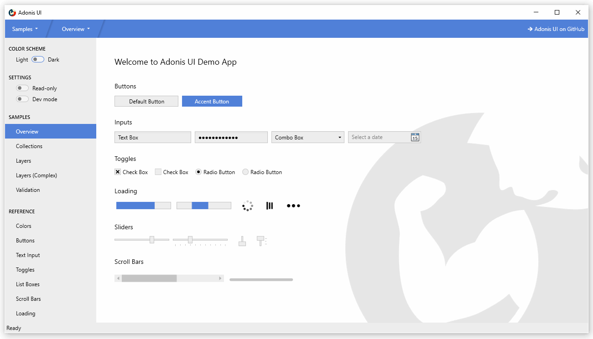
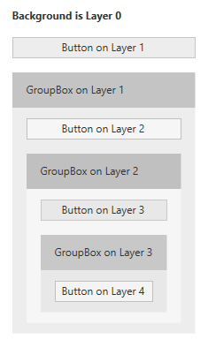
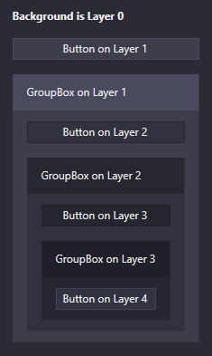

#  AdonisUI

[](https://www.nuget.org/packages/AdonisUI.ClassicTheme/)
[](https://www.nuget.org/packages/AdonisUI.ClassicTheme/)

[](https://opensource.org/licenses/MIT)	

Lightweight UI toolkit for WPF applications offering classic but enhanced windows visuals



## What's included

- Default styles with templates for almost all WPF controls
- Additional styles for convenience that can be used as required
- Two color schemes (light and dark) that can be used in custom styles as well
- Support for changing the color scheme at runtime
- Support for additional custom color schemes
- Extensions for built-in controls providing features like watermarks
- Few custom controls for common use cases

## Goals

1. Stay close to WPF's original look and feel
2. Do not require any configuration but provide options for those who want to control global and individual behavior
3. Favor extension of WPF's built-in controls over creation of new ones in order to be a drop-in replacement for existing applications

## Docs

- [See docs](https://benruehl.github.io/adonis-ui)

## Getting started

1. Reference `AdonisUI` and `AdonisUI.ClassicTheme` in your WPF project. It is available via [NuGet](https://www.nuget.org/packages/AdonisUI.ClassicTheme/) or [manual download](https://github.com/benruehl/adonis-ui/releases). Currently it requires at least .NET 4.0.
2. Add resources to your application in your `App.xaml` like so:

```xml
<Application xmlns:adonisUi="clr-namespace:AdonisUI;assembly=AdonisUI">
    <Application.Resources>
        <ResourceDictionary>
            <ResourceDictionary.MergedDictionaries>
                <ResourceDictionary Source="pack://application:,,,/AdonisUI;component/ColorSchemes/Light.xaml"/>
                <ResourceDictionary Source="pack://application:,,,/AdonisUI.ClassicTheme;component/Resources.xaml"/>
            </ResourceDictionary.MergedDictionaries>
        </ResourceDictionary>
    </Application.Resources>
</Application>
```

3. Derive your window's style from the default style of AdonisUI like so:

```xml
<Window.Style>
    <Style TargetType="Window" BasedOn="{StaticResource {x:Type Window}}"/>
</Window.Style>
```

## Features

### Switching color schemes at runtime

AdonisUI comes with a light and a dark color scheme. Adding custom color schemes is possible without limitations.

| Light Color Scheme | Dark Color Scheme |
| --- | --- |
|  | 

To switch color schemes at runtime the `ResourceDictionary` containing all colors and brushes of a scheme needs to be removed from the application resources so that a different one can be added. This can be done using the built-in `ResourceLocator` class for example in a click event handler.

```csharp
AdonisUI.ResourceLocator.SetColorScheme(Application.Current.Resources, ResourceLocator.DarkColorScheme);
```

The first parameter needs to be a reference to the `ResourceDictionary` containing the color scheme as part of its `MergedDictionaries`. The second parameter is a Uri to the color scheme that should be added.

[Read more about switching color schemes](docs/pages/colors-and-brushes.md#switching-color-schemes-at-runtime)

### Accent color

While relying on uniform colors for background areas and borders, an accent color can be used for visual highlighting of important spots. By default, both color schemes use blue as their accent color. This can be changed by overriding the accent color values. A set of styles helps to display controls like Buttons on the accent color.

[Read more about colors and brushes](docs/pages/colors-and-brushes.md)

### Cursor Spotlight hover effect

UI Controls like Buttons, TextBoxes, ComboBoxes, ListBoxes etc. that rely on interaction make use of a hover effect called Cursor Spotlight here. It makes a layer visible around the cursor when hovering over the control that is hidden otherwise. It works for both color schemes.

| Light Color Scheme | Dark Color Scheme |
| --- | --- |
|  | 

Because it works with `OpacityMasks` it is not limited to lightening up UI controls. It can be used to show an hide pretty much everything that can be rendered with WPF.

[Read more about the Cursor Spotlight effect](docs/pages/cursor-spotlight.md)

### Ripple effect

Buttons and ContextMenuItems show a ripple effect on click by default. ListBoxItems support it as well but have it disabled by default.

| Light Color Scheme | Dark Color Scheme |
| --- | --- |
|  | 

[Read more about the ripple effect](docs/pages/ripple.md)

### Layers

In UI design it is common to have containers grouping items that belong together. In WPF this can easily be achieved using GroupBoxes for example. If the container has a different background color assigned to better differentiate between the grouped items and their surroundings, color contrast can become an issue. Gray Buttons might look good on a white application background in the first place, but when they are moved into a GroupBox that has a gray background as well, they can loose visibility.

That is why AdonisUI introduces a simple layering system which automatically adjusts the colors of UI controls depending on the layer they belong to. All styles of AdonisUI respect the system automatically by default, but it can be disabled as well.

| Light Color Scheme | Dark Color Scheme |
| --- | --- |
|  | 

The images show a simple layout consisting of Buttons and GroupBoxes. All controls use their default styles without any properties set other than their contents. The layering system is responsible for slightly adjusting the colors of the Buttons and the GroupBoxes' backgrounds on each layer. It ensures that there is always a difference between the background of the container and the background of the controls in the container. Without the system all Buttons would have the exact same background color.

The system is fully customizable. It works for all controls and not just for Buttons, of course. Every control can be configured to increase the layer for its children, but it is already enabled by default for some controls like GroupBoxes. Controls can also be forced to reside on a specific layer.

[Read more about the layering system](docs/pages/layers.md)

### Data validation support

The data validation mechanism of WPF provides the ability to validate property values and assign error messages in case they are invalid. With AdonisUI, if a control binds to an invalid property the error is indicated in the control template by a red border and an error icon. The error message is displayed as a popup when the control gains keyboard focus or the user hovers over the icon. To set validation errors the interface `IDataErrorInfo` or `INotifyDataErrorInfo` from WPF can be used.

| Light Color Scheme | Dark Color Scheme |
| --- | --- |
|  | 

By default the error message popup is displayed on keyboard focus and mouse hover. Both can be disabled separately.

[Read more about data validation](docs/pages/data-validation.md)

### ComponentResourceKeys

Resources that are provided by AdonisUI have a ComponentResourceKey assigned to make use of them in a simple way. Resources exist in the categories _Colors_, _Brushes_, _Dimensions_, _Styles_, _Templates_ and _Icons_. The foreground brush of the current color scheme for example can be used by referring to its resource key like `Foreground="{DynamicResource {x:Static adonisUi:Brushes.ForegroundBrush}}"`. ComponentResourceKeys allow auto-completion with IntelliSense which comes in handy when exploring the available resources.

[Read more about resources](docs/pages/styles-and-templates.md)

### Space

Space between controls is typically controlled with margins, paddings and grid rows and columns. To make sure the space is consistent in every spot, a fixed size can be chosen that is used everywhere (or a multiple of it). AdonisUI provides a system supporting you in doing so. By default, the base value for space is `8`, but this can be adjusted for horizontal and vertical space separately.

Space can be applied like so:

```xml
<RowDefinition Height="{adonisUi:Space 1}"/> <!-- equals Height="8" -->
<RowDefinition Height="{adonisUi:Space 2.5}"/> <!-- equals Height="20" -->
<RowDefinition Height="{adonisUi:Space 2.5+1}"/> <!-- equals Height="21" -->
<RowDefinition Height="{adonisUi:Space 2.5-1}"/> <!-- equals Height="19" -->
```

The same works also for thicknesses like margin and padding:

```xml
<Button Margin="{adonisUi:Space 1}"/> <!-- equals Margin="8,8,8,8" -->
<Button Margin="{adonisUi:Space 1, 2}"/> <!-- equals Margin="8,16,8,16" -->
<Button Margin="{adonisUi:Space 1, 1+2, 2, 3}"/> <!-- equals Margin="8,10,16,24" -->
```

[Read more about space](docs/pages/space.md)

## Demo

There is a WPF demo application on board that shows most features of AdonisUI in action. Please don't hesitate to give it a try. More examples, screenshots and documentation are following soon.

## License

MIT © Benjamin Rühl
