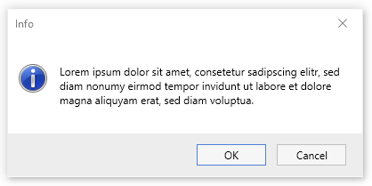
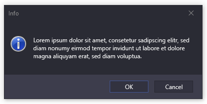
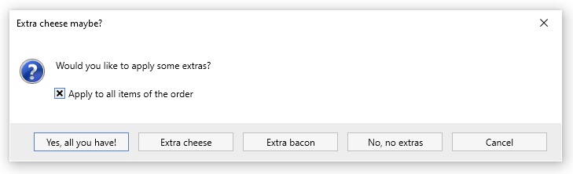

# Message Box

Adonis UI brings its own message box implementation because the default [`System.Windows.MessageBox`](https://docs.microsoft.com/en-us/dotnet/api/system.windows.messagebox) lacks support for theming. Adonis UI's messsage box is dark when using the dark color scheme and its buttons look like the default buttons of Adonis UI as one would expect.

| Light color scheme                                               | Dark color scheme                                              |
| ---------------------------------------------------------------- | -------------------------------------------------------------- |
|  |  |

## Features

Adonis UI's message box has an extended feature set comparing to `System.Windows.MessageBox`.

- **Support for WPF's styling system** - Unlike the default message box it can be styled via XAML like every other WPF control
- **Text selection** - The message box's content can be selected and copied
- **Content scrolling** - When there is more content than space on the screen, the message box displays a scroll bar automatically
- **Custom button labels** - Each button's label can be overridden
- **Custom buttons** - The buttons are no limited to *Yes*, *No*, *Ok* and *Cancel*; Additional buttons can be added as well
- **Check boxes** - Custom check boxes can be added and placed either below the text or next to the buttons
- **Enable / disable opening sound** - System sound is enabled by default but can be disabled on every opening individually

## Usage

### Quick start

The message box can be opened the same way as the default `System.Windows.MessageBox.Show()`. Just make sure to use `AdonisUI.Controls.MessageBox.Show()` instead.

```csharp
using AdonisUI.Controls;

MessageBox.Show("Hello world!");

MessageBox.Show("Hello world!", "Info", MessageBoxButton.OKCancel, MessageBoxImage.Information);
```

### Advanced

Under the hood, the message box uses a `MessageBoxModel` to control its functionality. Use this model directly to adjust more detailed aspects of the message box.

```csharp
using AdonisUI.Controls;

var messageBox = new MessageBoxModel
{
    Text = "Hello world!",
    Caption = "Info",
    Icon = MessageBoxImage.Information,
    Buttons = MessageBoxButtons.OkCancel(),
};

MessageBox.Show(messageBox);
```

Or even more advanced:

```csharp
using AdonisUI.Controls;

const string CHEESE_BUTTON_ID = "cheese";
const string BACON_BUTTON_ID = "bacon";

var messageBox = new MessageBoxModel
{
    Text = "Would you like to apply some extras?",
    Caption = "Extra cheese maybe?",
    Icon = MessageBoxImage.Question,
    Buttons = new []
    {
        MessageBoxButtons.Yes("Yes, all you have!"),
        MessageBoxButtons.Custom("Extra cheese", CHEESE_BUTTON_ID),
        MessageBoxButtons.Custom("Extra bacon", BACON_BUTTON_ID),
        MessageBoxButtons.No("No, no extras"),
        MessageBoxButtons.Cancel(),
    },
    CheckBoxes = new []
    {
        new MessageBoxCheckBoxModel("Apply to all items of the order")
        {
            IsChecked = true,
            Placement = MessageBoxCheckBoxPlacement.BelowText,
        },
    },
    IsSoundEnabled = false,
};

MessageBox.Show(messageBox);
```

This results in the following dialog:



The message box's result can be processed like this, for example:

```csharp
switch (messageBox.Result)
{
    case MessageBoxResult.Yes:
        ApplyAllExtras();
        break;
    case MessageBoxResult.Custom:
        if (messageBox.ButtonPressed.Id == CHEESE_BUTTON_ID)
            ApplyExtraCheese();
        else if (messageBox.ButtonPressed.Id == BACON_BUTTON_ID)
            ApplyExtraBacon();
        break;
}
```

## Customization

The message box can be styled via XAML. It offers some properties to customize its look without creating a custom template.

As the `MessageBoxWindow` derives from [AdonisWindow](./window.md), all of its styling options can be applied here as well.

Create a style like the following and add it to your application's resources:

```xml
<!-- xmlns:adonisUi="clr-namespace:AdonisUI;assembly=AdonisUI" -->
<!-- xmlns:adonisControls="clr-namespace:AdonisUI.Controls;assembly=AdonisUI" -->
<!-- xmlns:adonisExtensions="clr-namespace:AdonisUI.Extensions;assembly=AdonisUI" -->

<Style TargetType="{x:Type adonisControls:MessageBoxWindow}"
       BasedOn="{StaticResource {x:Type adonisControls:AdonisWindow}}">
    
    <!-- the maximum width of the message box relative to the current screen width -->
    <Setter Property="MaxRelativeScreenWidth" Value="0.9">

    <!-- the maximum height of the message box relative to the current screen height -->
    <Setter Property="MaxRelativeScreenHeight" Value="0.9">

    <!-- the style of all buttons inside the message box -->
    <Setter Property="ButtonStyle">
        <Setter.Value>
            <Style TargetType="Button"
                   BasedOn="{StaticResource {x:Type Button}}">
                <Setter Property="MinWidth" Value="78"/>
                <Setter Property="Margin" Value="0, 0, 12, 0"/>
                <Setter Property="Padding" Value="{adonisUi:Space 2, 0.5}"/>
            </Style>
        </Setter.Value>
    </Setter>

    <!-- the style of all check boxes inside the message box -->
    <Setter Property="CheckBoxStyle">
        <Setter.Value>
            <Style TargetType="CheckBox"
                   BasedOn="{StaticResource {x:Type CheckBox}}">
            </Style>
        </Setter.Value>
    </Setter>

    <!-- the style of the button container row -->
    <Setter Property="ButtonContainerStyle">
        <Setter.Value>
            <Style TargetType="Border">
                <Setter Property="Background"
                        Value="{DynamicResource {x:Static adonisUi:Brushes.Layer1BackgroundBrush}}"/>
                <Setter Property="adonisExtensions:LayerExtension.IncreaseLayer"
                        Value="True"/>
            </Style>
        </Setter.Value>
    </Setter>
</Style>
```

## Limitations

The following is a list of current limitations of the message box control.

### Localization

While the `System.Windows.MessageBox` displays its buttons localized by the installed language pack, the message box of Adonis UI does not. It uses english labels no matter which language is installed for the end user.

To localize the labels anyway, the built-in labels can be overridden for each `MessageBoxButton`. The developer has to provide the translations themselves though.

For example, to have german buttons:

```csharp
var messageBox = new MessageBoxModel
{
    Text = "Hallo welt!",
    Buttons = MessageBoxButtons.YesNoCancel("Ja", "Nein", "Abbrechen"),
};

MessageBox.Show(messageBox);
```
