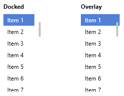

# Scroll Bars

Adonis UI provides some additional behavior for scroll bars that is described below.

## Expansion Mode

The default style for scroll bars introduces an **expand / collapse mechanic**.


By default, scroll bars are in a collapsed state which makes them appear slim and without scroll buttons. They take up more space physically than it looks like thought. When entering the space with the cursor they switch to the expanded state. This makes them appear like normal sized scroll bars which can be grabbed more easily than the collapsed version. In expanded state the scroll buttons become visible as well.

### Customization

The behavior is controlled via the `ExpansionMode` enum offering the following values:

- `AlwaysExpand` - Keep the scroll bar always expanded and never collapsed
- `ExpandOnHover` - Collapse the scroll bar by default and expand it when the mouse cursor enters it (default)
- `NeverExpand` - Keep the scroll bar always collapsed and never expanded

For `ScrollViewers`:

```xml
<!-- xmlns:adonisExtensions="clr-namespace:AdonisUI.Extensions;assembly=AdonisUI" -->
<ScrollViewer adonisExtensions:ScrollViewerExtension.VerticalScrollBarExpansionMode="AlwaysExpand"
              adonisExtensions:ScrollViewerExtension.HorizontalScrollBarExpansionMode="NeverExpand"/>
```

For controls containing a `ScrollViewer` like `TextBox`, `ComboBox`, `ListBox`, etc.:

```xml
<!-- xmlns:adonisExtensions="clr-namespace:AdonisUI.Extensions;assembly=AdonisUI" -->
<ComboBox adonisExtensions:ScrollViewerExtension.VerticalScrollBarExpansionMode="AlwaysExpand"
          adonisExtensions:ScrollViewerExtension.HorizontalScrollBarExpansionMode="NeverExpand"/>
```

For `ScrollBars`:

```xml
<!-- xmlns:adonisExtensions="clr-namespace:AdonisUI.Extensions;assembly=AdonisUI" -->
<ScrollBar adonisExtensions:ScrollBarExtension.ExpansionMode="AlwaysExpand"/>
```

The default behavior can be changed for the **whole application** as well by overriding the property of the default scroll bar style:

```xml
<!-- xmlns:adonisExtensions="clr-namespace:AdonisUI.Extensions;assembly=AdonisUI" -->
<Application.Resources>
    <ResourceDictionary>
        <ResourceDictionary.MergedDictionaries>
            <ResourceDictionary Source="pack://application:,,,/AdonisUI;component/ColorSchemes/Light.xaml"/>
            <ResourceDictionary Source="pack://application:,,,/AdonisUI.ClassicTheme;component/Resources.xaml"/>
        </ResourceDictionary.MergedDictionaries>

        <Style TargetType="ScrollBar"
               BasedOn="{StaticResource {x:Type ScrollBar}}">
            <Setter Property="adonisExtensions:ScrollBarExtension.ExpansionMode" Value="AlwaysExpand"/>
        </Style>

    </ResourceDictionary>
</Application.Resources>
```

## Placement

The `ScrollBarPlacement` enum offers options for how to position a scroll bar in relation to the scrolled content.

- `Docked` - Place the scroll bar next to the content (default)
- `Overlay` - Place the scroll bar on top of the content



For `ScrollViewers`:

```xml
<!-- xmlns:adonisExtensions="clr-namespace:AdonisUI.Extensions;assembly=AdonisUI" -->
<ScrollViewer adonisExtensions:ScrollViewerExtension.VerticalScrollBarPlacement="Overlay"
              adonisExtensions:ScrollViewerExtension.HorizontalScrollBarPlacement="Overlay"/>
```

For controls containing a `ScrollViewer` like `TextBox`, `ComboBox`, `ListBox`, etc.:

```xml
<!-- xmlns:adonisExtensions="clr-namespace:AdonisUI.Extensions;assembly=AdonisUI" -->
<ComboBox adonisExtensions:ScrollViewerExtension.VerticalScrollBarPlacement="Overlay"
          adonisExtensions:ScrollViewerExtension.HorizontalScrollBarPlacement="Overlay"/>
```
