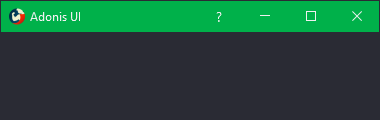
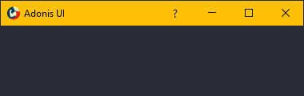
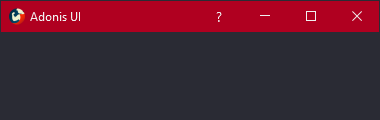
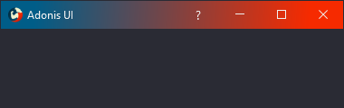

# Window

Adonis UI brings a custom window title bar which looks exactly like the Windows 10 title bar by default but has several advantages which are explained below. To make use of it, all your window classes have to be derived from `AdonisUI.Controls.AdonisWindow`.

Be aware that even though the window mimics the look and behavior of the Windows 10 window, it is a complete rebuild whose look is no longer controlled by the operating system. This means that it will look like this on all operating systems and does not change to the Windows 7 aero style on Windows 7 for example.

|                                                                |                                                                      |
| -------------------------------------------------------------- | -------------------------------------------------------------------- |
|  |      |
|      |  |

## Colors

To set the colors of the window's title bar the following properties can be used:

- `TitleBarForeground` - Sets the foreground brush of the window title and the window buttons
- `TitleBarBackground` - Sets the background brush of the window's title bar
- `WindowButtonHighlightBrush` - Sets the background brush for the window buttons on hovering

## Title bar content

By default, the title bar consists of the *application icon* on the left, the *window title* next to it and the *window buttons* on the right. The `AdonisWindow` class offers the following properties to modify this setup:

- `IconVisibility` - Sets the visibility of the application icon
- `TitleBarContent` - Sets content into the area between the title and the window buttons

When adding buttons to the title bar, the `WindowButton` style can be used to make them appear equal to the default window buttons.

```xml
<adonisControls:AdonisWindow xmlns="http://schemas.microsoft.com/winfx/2006/xaml/presentation"
                             xmlns:x="http://schemas.microsoft.com/winfx/2006/xaml"
                             xmlns:adonisUi="clr-namespace:AdonisUI;assembly=AdonisUI"
                             xmlns:adonisControls="clr-namespace:AdonisUI.Controls;assembly=AdonisUI">

    <adonisControls:AdonisWindow.TitleBarContent>
        <StackPanel Orientation="Horizontal"
                    HorizontalAlignment="Right">
            <Button Content="?"
                    Style="{DynamicResource {x:Static adonisUi:Styles.WindowButton}}"
                    FontFamily="Segoe UI"
                    FontSize="14"/>
        </StackPanel>
    </adonisControls:AdonisWindow.TitleBarContent>
    
</adonisControls:AdonisWindow>
```

## Title bar size

The title bar aims at behaving exactly like the default native title bar. That's why it shrinks a little when the window is maximized.

This can be disabled by setting `ShrinkTitleBarWhenMaximized` on `AdonisWindow` to `false`.

```xml
<adonisControls:AdonisWindow ShrinkTitleBarWhenMaximized="False"/>
```
