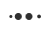

# Loading and Progress

Progress bars have two different appearances depending on the value of the [`IsIndeterminate`](https://docs.microsoft.com/en-us/dotnet/api/system.windows.controls.progressbar.isindeterminate) property.


## Animation

The determinate progress bar (left) has an additional ripple animation which can be disabled.

```xml
<!-- xmlns:adonisExtensions="clr-namespace:AdonisUI.Extensions;assembly=AdonisUI" -->
<ProgressBar adonisExtensions:ProgressBarExtension.IsProgressBarAnimationEnabled="False"/>
```

## Content

AdonisUI extends the default progress bars with properties for setting direct content. This eliminates the need of placing content on top of progress bars using grids. It further has the advantage that the content's foreground is adjusted when it intersects with the progress.


The code for the example above:

```xml
<!-- xmlns:adonisExtensions="clr-namespace:AdonisUI.Extensions;assembly=AdonisUI" -->
<ProgressBar adonisExtensions:ProgressBarExtension.Content="ProgressBar with Content"
             Minimum="0"
             Value="70"
             Maximum="100"
             Padding="0, 2"/>
```

In case the content is more than simple text but consists of child controls, the `ContentTemplate` property should be used instead of `Content`. Otherwise, the progress bar will probably not be rendered correctly.
A more complex example:


```xml
<!-- xmlns:adonisExtensions="clr-namespace:AdonisUI.Extensions;assembly=AdonisUI" -->
<ProgressBar Minimum="0"
             Value="70"
             Maximum="100"
             Padding="0, 2"
             HorizontalContentAlignment="Right"
             adonisExtensions:ProgressBarExtension.Foreground="{DynamicResource {x:Static adonisUi:Brushes.ErrorBrush}}"
             adonisExtensions:ProgressBarExtension.ProgressAnimationForeground="{DynamicResource {x:Static adonisUi:Brushes.SuccessBrush}}">
    <adonisExtensions:ProgressBarExtension.ContentTemplate>
        <DataTemplate>
            <StackPanel Orientation="Horizontal">
                <Ellipse Width="12"
                         Height="12"
                         Fill="{Binding Foreground, RelativeSource={RelativeSource FindAncestor, AncestorType=Control}}"
                         Margin="{adonisUi:Space 0, 0, 0.5, 0}"/>
                <TextBlock Text="Error to Success"/>
            </StackPanel>
        </DataTemplate>
    </adonisExtensions:ProgressBarExtension.ContentTemplate>
</ProgressBar>
```

## Loading Indicators

Currently, the following loading indicators can be used:

### Loading Circle


### Loading Bars


### Loading Dots



All of them are simple `DataTemplates` that can be used like so:

```xml
<ContentControl ContentTemplate="{DynamicResource {x:Static adonisUi:Templates.LoadingCircle}}"
                Foreground="{DynamicResource {x:Static adonisUi:Brushes.ForegroundBrush}}"
                Width="24"
                Height="24"
                Focusable="False"/>
```

They are scalable in size and make use of the foreground brush of the parent control.
