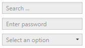

# Watermark

A pale rendered text that can be set on some controls. It disappears as soon as the users enters input.



Available for following controls:
- `TextBox`
- `PasswordBox`
- `ComboBox`

Can be set using `AdonisUI.Extensions.WatermarkExtension`:

```xml
<!-- xmlns:adonisExtensions="clr-namespace:AdonisUI.Extensions;assembly=AdonisUI" -->

<TextBox adonisExtensions:WatermarkExtension.Watermark="Search ..."/>
```
